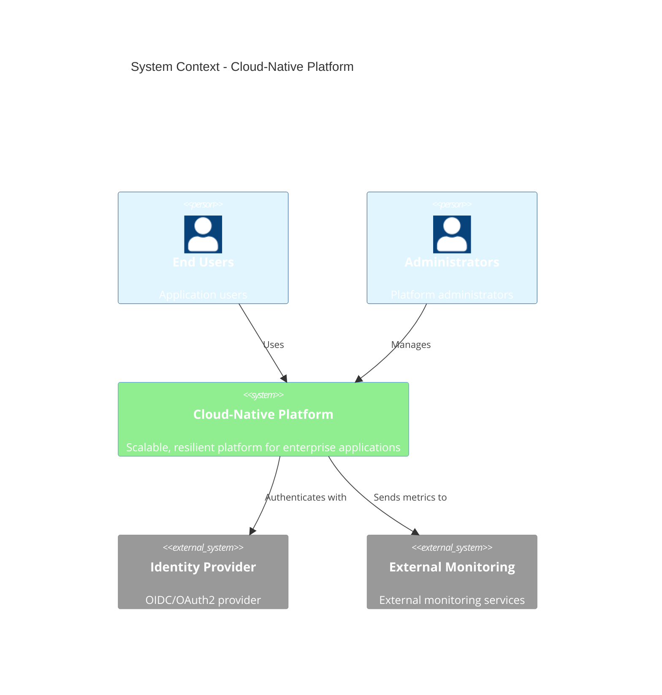
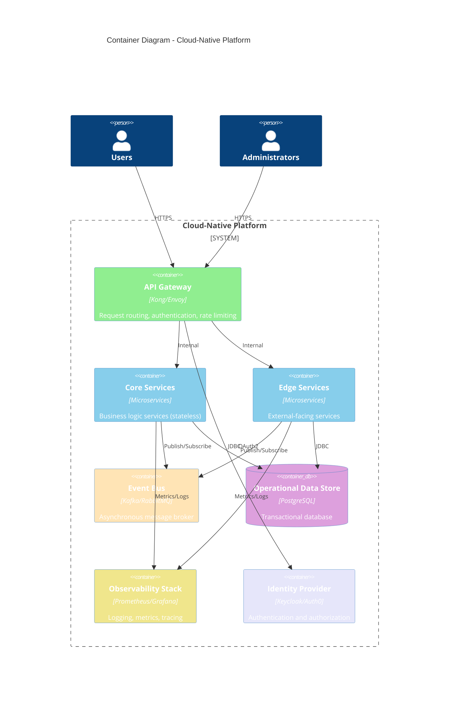

# C4 – Cloud-Native Platform

> **Icarus Nova** | High-level container diagram for cloud-native platform architecture.

## System Context

## Container Diagram

## Key Interactions

### Request Flow

1. **User Request**: User sends request to API Gateway
2. **Authentication**: API Gateway authenticates with Identity Provider
3. **Routing**: API Gateway routes to appropriate service (Core or Edge)
4. **Processing**: Service processes request, may publish events
5. **Response**: Service returns response through API Gateway
6. **Observability**: All operations logged and metered

### Event Flow

1. **Event Publishing**: Service publishes event to Event Bus
2. **Event Distribution**: Event Bus distributes to subscribers
3. **Event Processing**: Subscriber services process events
4. **State Updates**: Services update state based on events

## Notes

This is a high-level container view to communicate primary interactions. For detailed component views, see the architecture documentation.

## Related Documents

- [Cloud-Native Platform Architecture](../docs/cloud-native-platform.md)
- [Reference Architectures Index](../docs/index.md)

---

**Last Updated:** 2024  
**Maintained by:** Icarus Nova Architecture Team  
**Version:** 1.0
