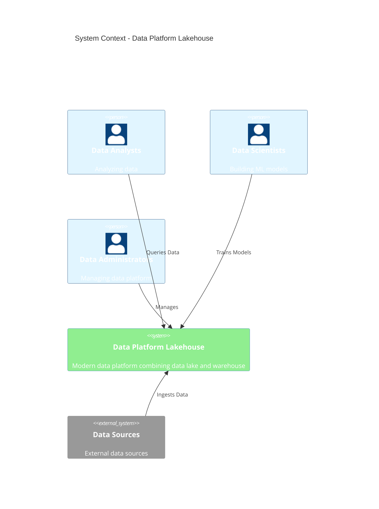
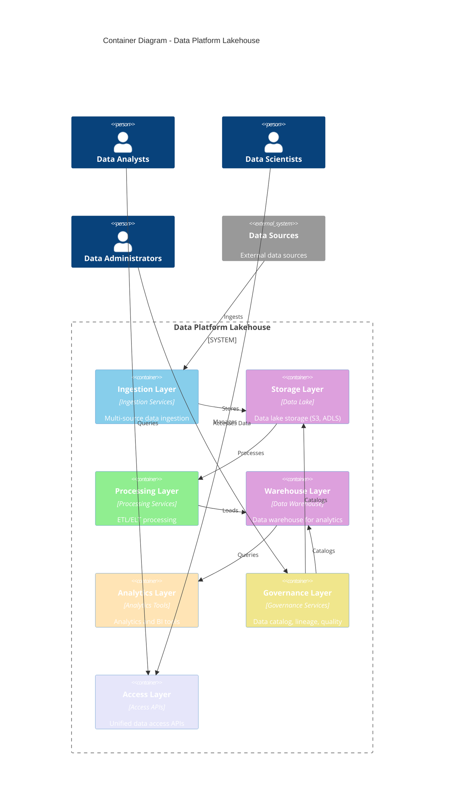

# C4 – Data Platform (Lakehouse)

> **Icarus Nova** | High-level container diagram for data platform lakehouse architecture.

## System Context

## Container Diagram

## Key Interactions

### Data Flow

1. **Data Ingestion**: Ingestion layer ingests data from multiple sources
2. **Data Storage**: Data stored in data lake (raw data)
3. **Data Processing**: Processing layer transforms data (ETL/ELT)
4. **Data Warehouse**: Processed data loaded into data warehouse
5. **Data Analytics**: Analytics tools query data warehouse
6. **Data Governance**: Governance layer catalogs and tracks data lineage
7. **Data Access**: Access layer provides unified data access

## Related Documents

- [Data Platform Lakehouse Architecture](../docs/data-platform-lakehouse.md)
- [Reference Architectures Index](../docs/index.md)

---

**Last Updated:** 2024  
**Maintained by:** Icarus Nova Architecture Team  
**Version:** 1.0
