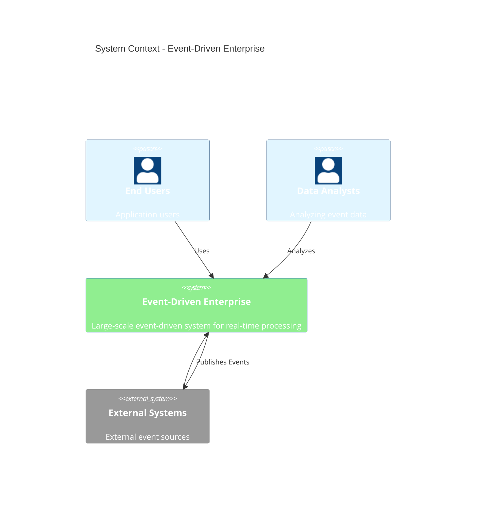
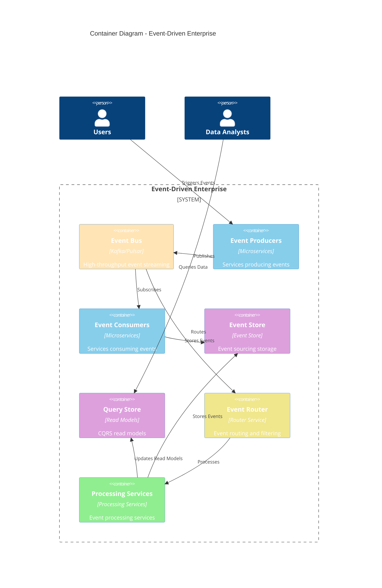

# C4 – Event-Driven Enterprise

> **Icarus Nova** | High-level container diagram for event-driven enterprise architecture.

## System Context

## Container Diagram

## Key Interactions

### Event Flow

1. **Event Production**: Producers publish events to Event Bus
2. **Event Routing**: Event Router routes events to appropriate consumers
3. **Event Processing**: Processing services process events
4. **Event Storage**: Events stored in Event Store (event sourcing)
5. **Read Model Update**: Read models updated for queries
6. **Event Consumption**: Consumers process events and update state

## Related Documents

- [Event-Driven Enterprise Architecture](../docs/event-driven-enterprise.md)
- [Reference Architectures Index](../docs/index.md)

---

**Last Updated:** 2024  
**Maintained by:** Icarus Nova Architecture Team  
**Version:** 1.0
