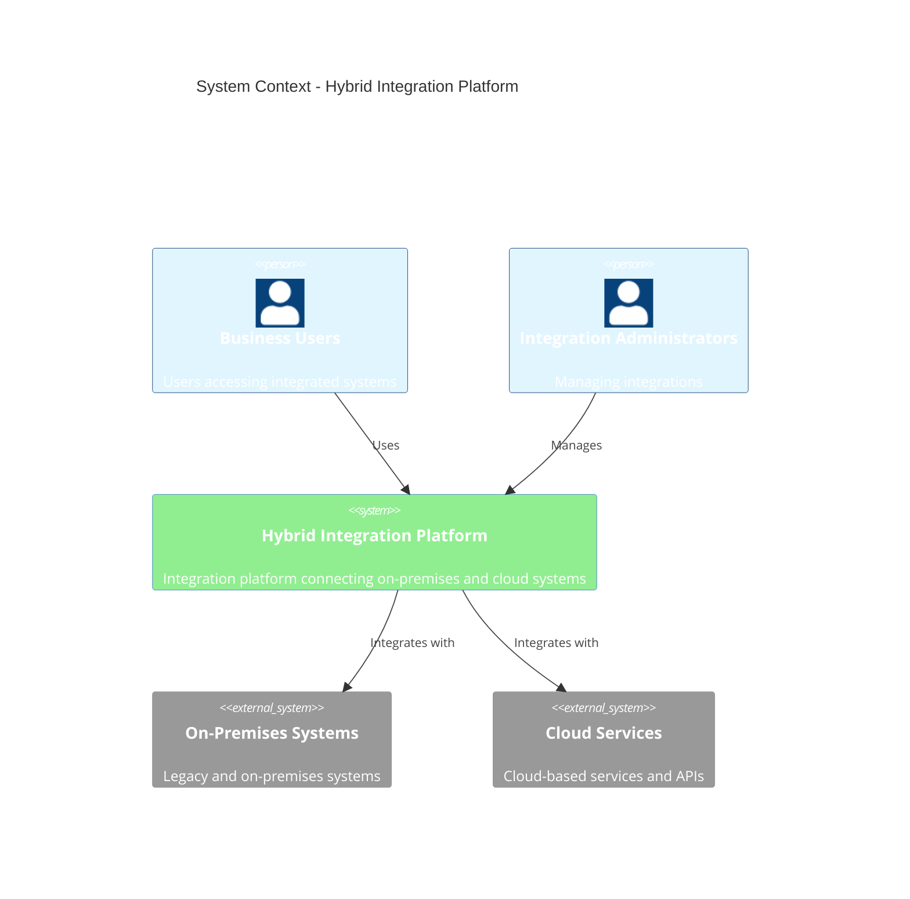
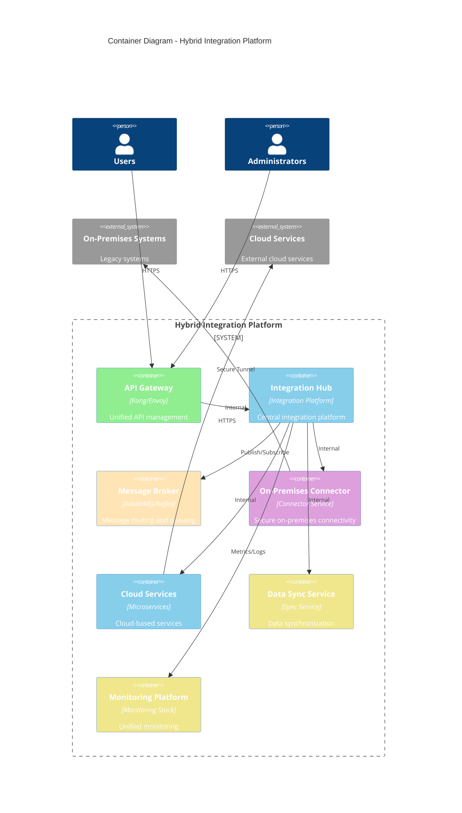

# C4 – Hybrid Integration Platform

> **Icarus Nova** | High-level container diagram for hybrid integration platform architecture.

## System Context

## Container Diagram

## Key Interactions

### Integration Flow

1. **Request**: User sends request via API Gateway
2. **Routing**: API Gateway routes to Integration Hub
3. **Transformation**: Hub transforms and routes message
4. **On-Premises**: Connector securely connects to on-premises systems
5. **Cloud**: Cloud services connect to external cloud services
6. **Synchronization**: Data sync service synchronizes data
7. **Monitoring**: All operations monitored

## Related Documents

- [Hybrid Integration Platform Architecture](../docs/hybrid-integration-platform.md)
- [Reference Architectures Index](../docs/index.md)

---

**Last Updated:** 2024  
**Maintained by:** Icarus Nova Architecture Team  
**Version:** 1.0
