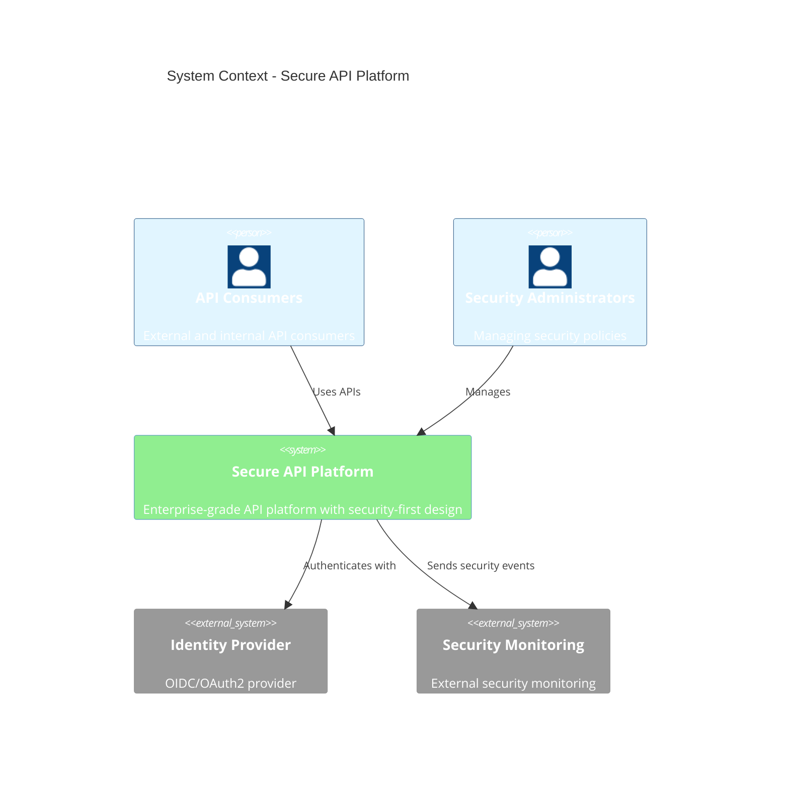
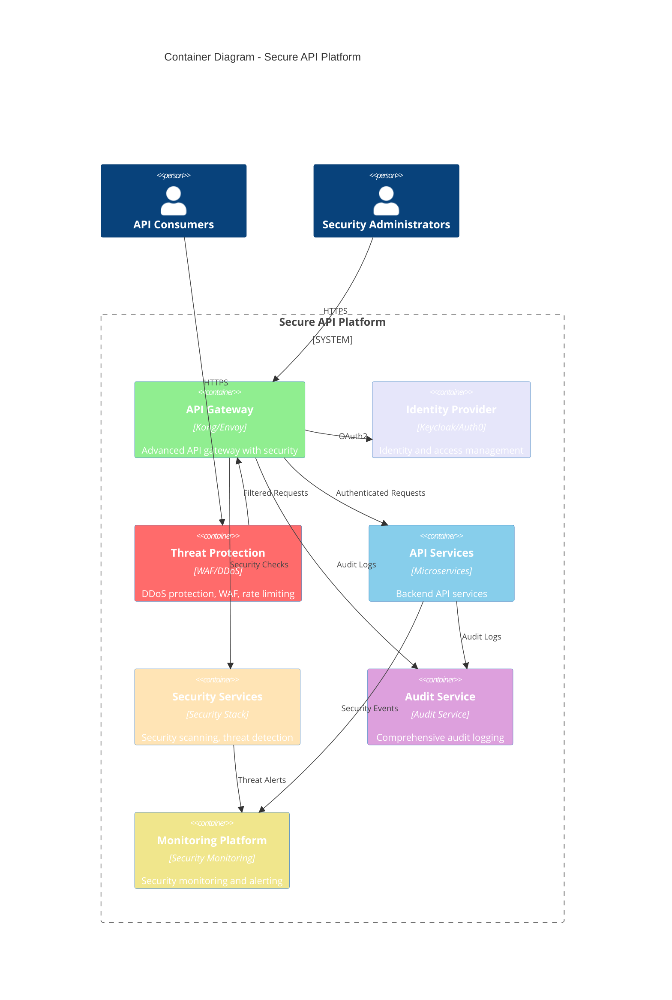

# C4 – Secure API Platform

> **Icarus Nova** | High-level container diagram for secure API platform architecture.

## System Context

## Container Diagram

## Key Interactions

### Secure API Request Flow

1. **Request**: User sends request to Threat Protection
2. **Threat Check**: Threat protection filters malicious requests
3. **Authentication**: API Gateway authenticates with Identity Provider
4. **Authorization**: API Gateway authorizes request
5. **Security Scan**: Security services scan for threats
6. **API Processing**: API services process request
7. **Audit**: All operations logged
8. **Monitoring**: Security events monitored

## Related Documents

- [Secure API Platform Architecture](../docs/secure-api-platform.md)
- [Reference Architectures Index](../docs/index.md)

---

**Last Updated:** 2024  
**Maintained by:** Icarus Nova Architecture Team  
**Version:** 1.0
